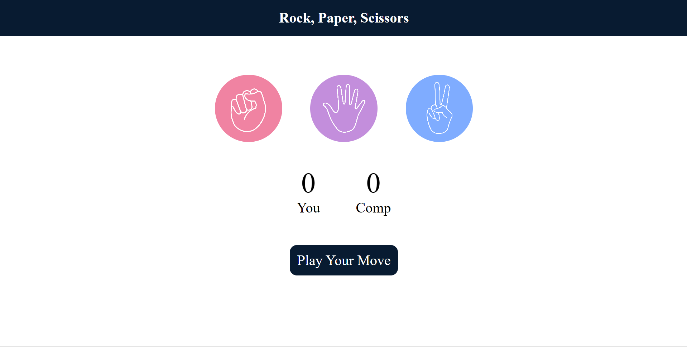
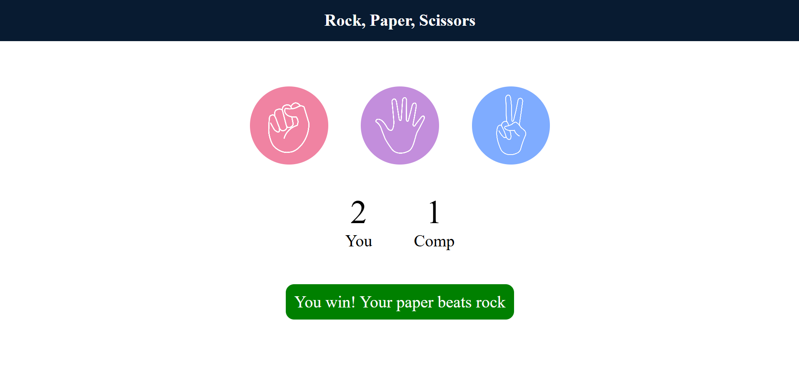

# ✊✋✌️ Rock Paper Scissors - Web Game

This is a fun and interactive **Rock, Paper, Scissors** game made using **HTML**, **CSS**, and **JavaScript**. The player competes against the computer, and the first to score higher wins. The UI is clean, responsive, and gives real-time feedback based on the outcome of each round.

---

## 🎯 Features

- 🧠 Computer randomly chooses between Rock, Paper, and Scissors
- 👆 Click-based gameplay for user choice
- 📊 Live score tracking (User vs Computer)
- 🟢 Win / 🔴 Lose / ⚫ Draw message with color-coded feedback
- 🎨 Clean and responsive UI

---

## 📸 Screenshots





---

## 🛠️ Tech Stack

- **HTML5** – Page structure
- **CSS3** – Styling and layout
- **Vanilla JavaScript** – Game logic and DOM manipulation

---

## 🚀 How to Run Locally

1. Clone the repository:
   ```bash
   git clone https://github.com/ankitkumarsinha6/rockPaperScissors---Game.git
   cd rockPaperScissors
2. Open index.html in any modern browser.

   📁 Project Structure

rockPaperScissors/
├── index.html         # Main game interface
├── style.css          # Styling for the game
├── app.js             # Game logic in JavaScript
├── rock.png           # Rock image
├── paper.png          # Paper image
├── scissors.png       # Scissors image
└── screenshots/       # Game screenshots (optional)

🙌 Contributing
Pull requests and suggestions are welcome! Feel free to fork the project and improve the UI, add animations, or expand it to multiplayer mode.

📬 Contact
Created with ❤️ by Ankit Kumar Sinha
📧 ankitkumarsinha6@gmail.com
🌐 Your Portfolio or LinkedIn
